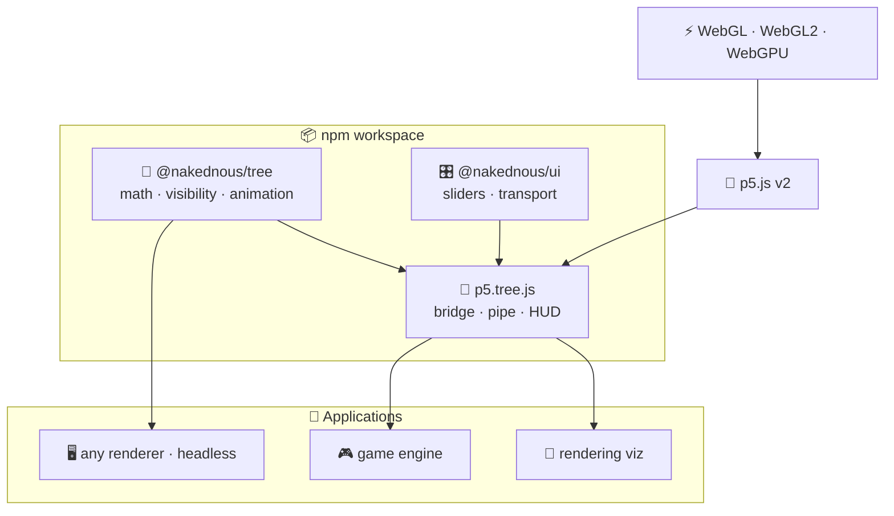
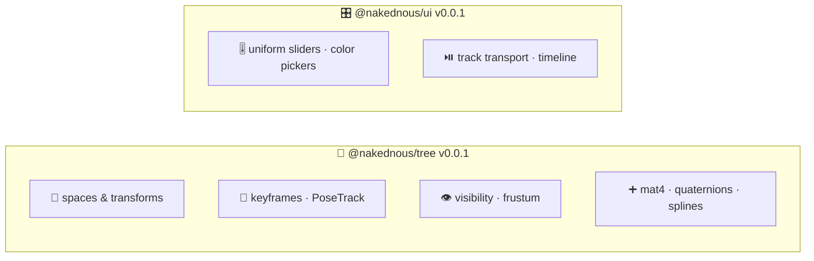
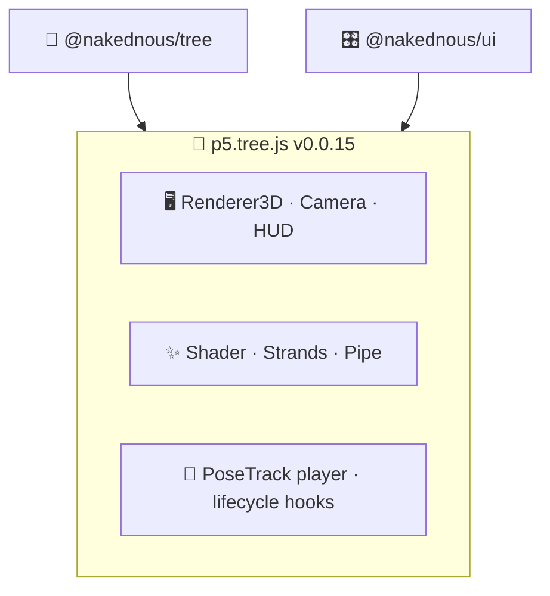
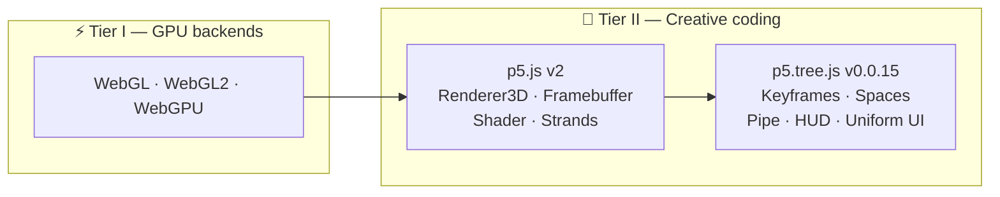
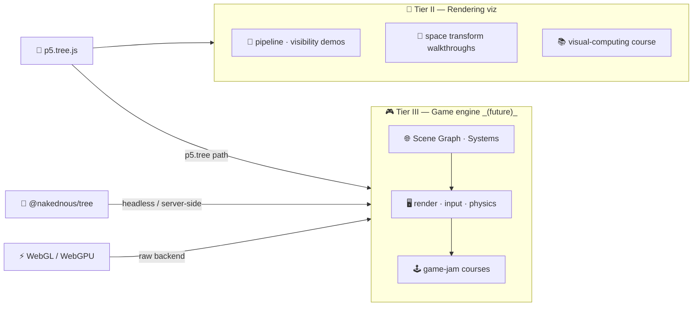

---
# try also 'default' to start simple
theme: seriph
# new background image
# background: https://raw.githubusercontent.com/visualcomputing/p5.treegl/main/p5.treegl.png
background: "p5.tree.png"
# apply any unocss classes to the current slide
class: 'text-center'
# https://sli.dev/custom/highlighters.html
highlighter: shiki
# some information about the slides, markdown enabled
info: |
  ## Edu-software research
  Using advanced rendering techniques

  More info at our [blog](https://jpcharalambosh.co)
transition: slide-left
title: Designing a Game Engine for GBL
mdc: true
hideInToc: true
---

# ABJ-d
**Designing a Game Engine for Game-Based Learning**

[Jean Pierre Charalambos](mailto:jpcharalambosh@unal.edu.co)

[Universidad Nacional de Colombia, sede Bogotá](https://unal.edu.co/)

---
layout: center
hideInToc: true
---

# Table of contents

<Toc maxDepth="1"></Toc>

---
level: 1
---
# Arch
Three focused packages. Clean dependency direction. Each layer replaceable.



> `deps/tree` and `deps/ui` never import from the bridge — dependency arrow never reverses.

---
layout: center
---

## deps — two independent packages



> **Zero cross-dependency.** Either package can be embedded in any renderer or framework.

---
layout: center
---

## p5.tree.js v0.0.15 — bridge layer



> **Rule:** `deps/tree` and `deps/ui` never import from the bridge.  
> Data flows one way — always up.

---
layout: center
---

## Foundation stack



> The creative coding layer is the **stable shared foundation** for every tier above it.

---
layout: center
---

## What gets built on top



> Tier II **now** — research + teaching.  
> Tier III **plugs into any layer** — p5.tree, raw WebGL, or headless `@nakednous/tree`.

---
level: 1
layout: center
---
# Show, don't tell
**Live demonstrations** — each built on the same three-package stack

→ 🖱️ Screen-space picking  
→ 🎬 Camera path interpolation  
→ 🎯 Object animation · PoseTrack  
→ ✨ Post-FX pipeline · shaders  
→ 👁️ Frustum culling · visibility

---
layout: center
hideInToc: true
---
# Screen-space picking
Hover any object — no GPU readback, no raycasting. Pure screen-space proximity.
<PickingDemo />

---
layout: center
hideInToc: true
---
# How picking works
```js
// 🗄️ cache pvMatrix once per frame — shared across all objects
const pv = p.pvMatrix()

models.forEach(m => {
  p.push()
  p.translate(m.position)

  // params reused for both picking and overlay drawing
  const params = { pvMatrix: pv, size: m.size * 2.5 }

  // projects model origin → screen, tests mouse distance < size/2
  const hit = p.mousePicking(params)

  hit ? p.emissiveMaterial(1, 1, 1) : p.specularMaterial(m.color)
  p.sphere(m.size)

  // bullsEye overlay drawn at the same projected screen position
  p.stroke(hit ? 'yellow' : 'steelblue')
  p.bullsEye(params)   // reuses the same pvMatrix — no re-projection

  p.pop()
})
```

> `size` in `params` is **world-space** — internally divided by `pixelRatio(worldPos)` so the hit region shrinks with distance, matching the rendered object size on screen.  
> One `pvMatrix()` call per frame — not per object.

---
layout: center
hideInToc: true
---
# Current limits · future work
```js
// ✅ what works today — screen-space proximity
const hit = p.mousePicking({ pvMatrix: pv, size: m.size * 2.5 })

// size * 2.5 is a heuristic — works well for convex shapes
// but over-selects on elongated or concave geometry
```

> **Current approach** — project object origin to screen, test mouse within a radius.  
> Fast, zero GPU overhead, good enough for most interactive scenes.

> **Future work** — precise picking via GL buffers:  
> render object IDs into an offscreen framebuffer, read the pixel under the cursor.  
> Sub-pixel accurate, handles any geometry — planned as a standalone module.

---
layout: center
hideInToc: true
---
# Smooth camera paths
Record keyframes. Play back a spline-interpolated fly-through.
<TreeSketch />

---
layout: center
---

## camera path — setup

```js
p.setup = function () {
  p.createCanvas(600, 340, p.WEBGL)

  // 📍 record keyframes: eye · center · up
  p.addPath([0, 0, 480],     [0, 0, 0], [0, 1, 0])
  p.addPath([300, -150, 0],  [0, 0, 0], [0, 1, 0])
  p.addPath([-220, 80, 280], [0, 0, 0], [0, 1, 0])
  p.addPath([0, 0, 480],     [0, 0, 0], [0, 1, 0]) // 🔁 loop back

  // 🎛️ transport panel — mounts next to canvas, no camera ref needed
  p.createTrackUI({ add: true, info: true, color: 'white' })
}
```

> `addPath` captures a camera pose. `createTrackUI` wires ▶ ⏸ ↺ and **+** automatically — `curCamera` is the implicit target.

---
layout: center
---

## camera path — draw & keys

```js
p.draw = function () {
  p.background(18, 20, 30)
  p.orbitControl()   // 🖱️ free orbit between playbacks
  // ... scene objects
}

p.keyPressed = function () {
  if (p.key === 'p') p.playPath()   // ▶ play
  if (p.key === 'r') p.resetPath()  // ↺ reset
}
```

> `orbitControl` and the path player coexist — orbit is active when the track is idle. `playPath` / `resetPath` are global forwarders; no camera variable needed anywhere.

---
layout: center
hideInToc: true
---
# Animating objects in 3D space
TRS keyframes — position · rotation · scale — interpolated every frame.
<PoseTrackDemo />

---
layout: center
---

## PoseTrack — setup

```js
p.setup = function () {
  p.createCanvas(600, 340, p.WEBGL)

  track = p.createPoseTrack()

  // 📍 TRS keyframes — pos · rot (axis-angle) · scl
  track.add({ pos: [0,    0,   0],  scl: [1,   1, 1] })
  track.add({ pos: [160, -60,  80],
              rot: { axis: [1, 0, 0], angle: PI },
              scl: [1, 2.5, 1] })
  track.add({ pos: [-140, 80, -60],
              rot: { axis: [0, 0, 1], angle: PI },
              scl: [2.5, 1, 1] })
  track.add({ pos: [0, 0, 0], scl: [1, 1, 1] })  // 🔁 loop back

  // 🎛️ transport panel — explicit track ref required (not curCamera)
  p.createTrackUI(track, { rate: 0.4, info: true, color: 'white' })

  // 🎨 user hook — fires at natural end of each playback cycle
  track.onEnd = () => { bg = [random(255), random(255), random(255)] }
}
```

> `rot` accepts **axis-angle**, a raw `[x,y,z,w]` quaternion, or a **look-dir** object — the parser normalises all forms. `onEnd` fires on natural boundary only — not on `stop()` or `reset()`.

---
layout: center
---

## PoseTrack — draw

```js
p.draw = function () {
  p.background(...bg)
  p.orbitControl()

  // 🎯 eval() returns current { pos, rot, scl } — no allocation per call
  p.push()
  p.applyPose(track.eval())        // translate · rotateQuat · scale
  p.axes({ size: 60, bits:
    p5.Tree.X | p5.Tree._X |       // ± local axes visualise the pose
    p5.Tree.Y | p5.Tree._Y |
    p5.Tree.Z | p5.Tree._Z })
  p.cylinder(30, 80)
  p.pop()
}
```

> `track.eval()` reads the cursor without advancing it — `tick()` is called automatically each `predraw` by the registered player. `applyPose` decomposes to `translate` + `rotateQuat` + `scale` in one call.

---
layout: center
hideInToc: true
---
# Post-processing as a pipeline
Scene to framebuffer. GLSL filter as a live-tunable pass.
<FxPipeDemo />

---
layout: center
hideInToc: true
---
# Writing a GLSL 3 filter

```glsl
#version 300 es
precision mediump float;

uniform sampler2D tex0;
uniform float strength;   // RGB split radius
uniform float vignette;   // falloff intensity

in  vec2 vTexCoord;       // replaces varying (GLSL 3)
out vec4 outColor;        // replaces gl_FragColor (GLSL 3)

void main() {
  vec2 dir = vTexCoord - 0.5;                         // from screen centre

  // Push R out, pull B in — G stays sharp
  float r = texture(tex0, vTexCoord + dir * strength * 0.04).r;
  float g = texture(tex0, vTexCoord).g;
  float b = texture(tex0, vTexCoord - dir * strength * 0.04).b;

  // Radial vignette — darkens edges
  float vig = 1.0 - smoothstep(0.35, 1.0, length(dir) * vignette);

  outColor = vec4(r, g, b, 1.0) * vig;
}
```

> Two uniforms — `strength` and `vignette` — driven live by the panel.

---
layout: center
hideInToc: true
---
# `createUniformUI` — push vs pull

```js
// ── pull pattern — no target, you read each frame ────────────────────
uiScene = p.createUniformUI({
  speed:     { min: 0, max: 0.05, value: 0.012, step: 0.001 },
  shininess: { min: 1, max: 200,  value: 80,    step: 1     },
}, { title: 'Scene', labels: true, color: 'white' })

// in draw():
p.shininess(uiScene.shininess.value())   // plain JS read

// ── push pattern — target: panel calls setUniform() every frame ──────
chromaFilter = p.createFilterShader(chromaFrag)

uiChroma = p.createUniformUI({
  strength: { min: 0, max: 1, value: 0.4, step: 0.01 },
  vignette: { min: 0, max: 3, value: 1.4, step: 0.05 },
}, { target: chromaFilter, title: 'Chroma + Vignette', labels: true, color: 'white' })

// in draw():
p.pipe(layer, enabled.chroma ? [chromaFilter] : [])
// ↑ no setUniform() calls — the UI owns the push
```

> **Pull** = manual, flexible — great for scene params.  
> **Push** = declarative, zero boilerplate — great for GLSL uniforms.

---
layout: center
hideInToc: true
---
# Frustum culling — live
Classify every object against the view frustum every frame. Zero allocations.
<VisibilityDemo />

---
layout: center
hideInToc: true
---
# Visibility query — one call per object

```js
// Sphere
m.cull = function () {
  this.visibility = p.visibility({ center: this.position, radius: this.radius })
}

// Box
m.cull = function () {
  this._c1.set(this.position.x - hw, this.position.y - hh, this.position.z - hd)
  this._c2.set(this.position.x + hw, this.position.y + hh, this.position.z + hd)
  this.visibility = p.visibility({ corner1: this._c1, corner2: this._c2 })
}

// in draw() — result drives render decisions
if      (m.visibility === p5.Tree.VISIBLE)     { p.fill(m.color); p.noStroke() }
else if (m.visibility === p5.Tree.SEMIVISIBLE) { p.noFill();      p.stroke(m.color) }
// INVISIBLE → skip entirely
```

> `visibility()` tests against the current frustum planes.  
> Three states — **VISIBLE · SEMIVISIBLE · INVISIBLE** — let you reduce geometry detail or skip draw calls entirely.

---
layout: center
hideInToc: true
---
# Frustum visualisation + HUD inset

```js
// Cache e and pm once per frame — reused by viewFrustum and visibility
e  = p.eMatrix()   // 📷 eye matrix  — where the camera is in world space
pm = p.pMatrix()   // 📐 projection  — what the camera sees

// Draw the frustum shape into the overview scene
p.viewFrustum({
  eMatrix: e, pMatrix: pm,
  bits: p5.Tree.NEAR | p5.Tree.FAR,
  viewer: () => p.axes({ size: 50 })
})

// Render the culled view into a framebuffer, stamp it as a HUD inset
fbo.begin(); /* draw scene */ fbo.end()

p.beginHUD()
p.translate(p.width - p.width / 3, p.height)
p.scale(1, -1)                                 // flip Y — FBO origin is bottom-left
p.image(fbo, 0, 0, p.width / 3, p.height / 3)
p.endHUD()
```

> `eMatrix` and `pMatrix` are the only state `viewFrustum` and `visibility` need —  
> cache them once, pass everywhere. Two cameras, one canvas.

---
layout: center
hideInToc: true
---

# Thank you 🙏

### Questions? 💡
