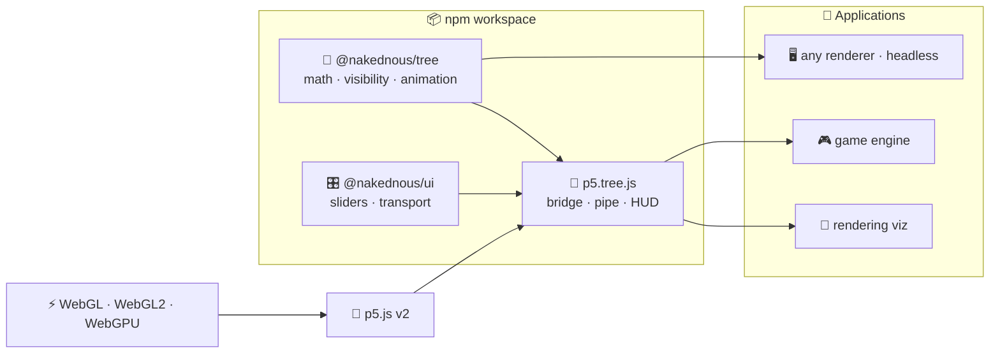
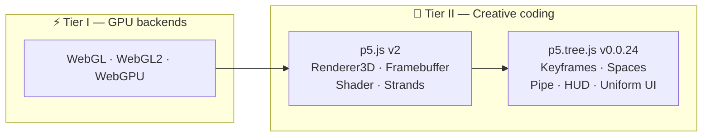
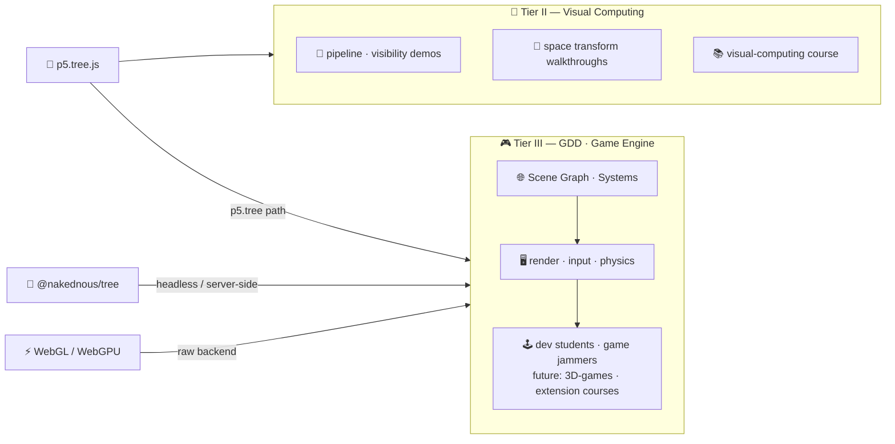
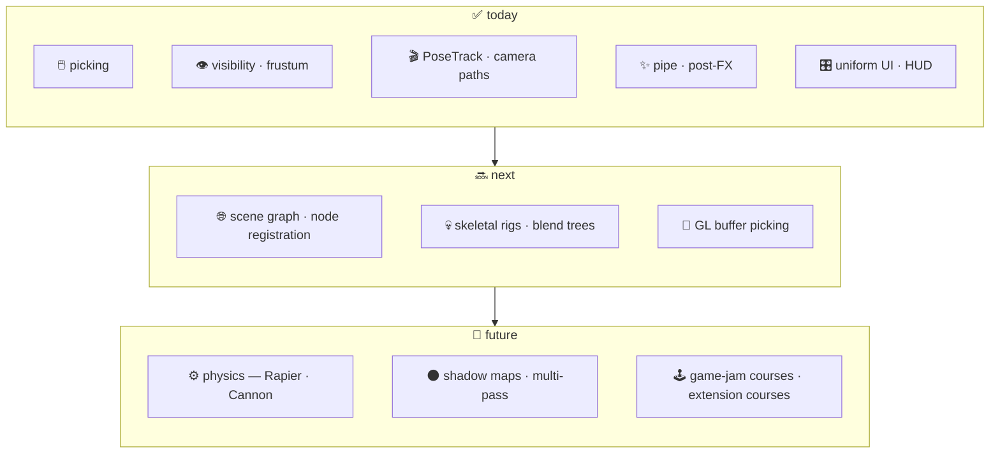
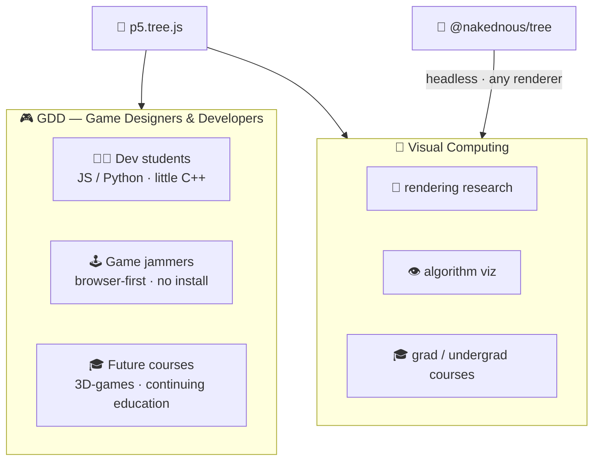
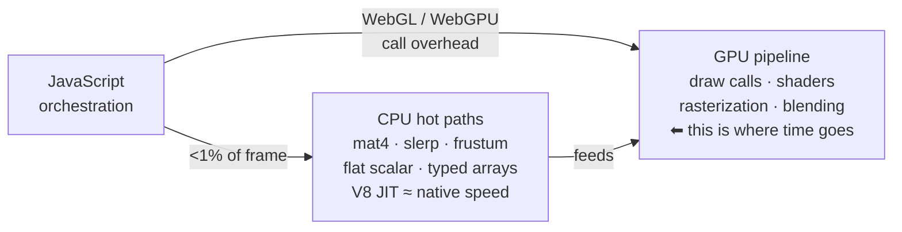

---
# try also 'default' to start simple
theme: seriph
# new background image
# background: https://raw.githubusercontent.com/visualcomputing/p5.treegl/main/p5.treegl.png
background: "p5.tree.png"
# apply any unocss classes to the current slide
class: 'text-center'
# https://sli.dev/custom/highlighters.html
highlighter: shiki
# some information about the slides, markdown enabled
info: |
  ## Edu-software research
  Using advanced rendering techniques

  More info at our [blog](https://jpcharalambosh.co)
transition: slide-left
title: Designing a Game Engine for GBL
mdc: true
hideInToc: true
---

# ABJ-d
**Designing a Game Engine for Game-Based Learning**

[Jean Pierre Charalambos](mailto:jpcharalambosh@unal.edu.co)

[Universidad Nacional de Colombia, sede Bogotá](https://unal.edu.co/)

---
layout: center
hideInToc: true
---

# Table of contents

<Toc maxDepth="1"></Toc>

---
level: 1
---
# Architecture
Three packages. One dependency direction. Each layer independently deployable.



> `@nakednous/tree` runs anywhere — browser, server, or headless. `deps` never import from `p5.tree.js`.

---
layout: center
---

## deps — two independent packages


> **Zero cross-dependency.** Either package can be embedded in any renderer or framework.

---
layout: center
---

## p5.tree.js v0.0.24 — bridge layer


> **Rule:** `deps/tree` and `deps/ui` never import from the bridge.  
> Data flows one way — always up.

---
layout: center
---

## Foundation stack



> The creative coding layer is the **stable shared foundation** for every tier above it.

---
layout: center
---

## What gets built on top



> Tier II **now** — research + teaching.  
> Tier III **plugs into any layer** — p5.tree, raw WebGL, or headless `@nakednous/tree`.

---
level: 1
layout: center
---
# Showcase
**Live demonstrations** — each built on the same three-package stack

→ 🖱️ GPU color-ID picking  
→ 🎬 Camera path interpolation  
→ 🎯 Object animation · PoseTrack  
→ ✨ Post-FX pipeline · shaders  
→ 👁️ Frustum culling · visibility

---
layout: center
---
## GPU color-ID picking
Hover any object — sub-pixel accurate, handles any geometry. No raycasting, no heuristics.
<PickingDemo />

---
layout: center
---
### How picking works
```js
// ── pick pass — one mousePick call resolves the whole scene ──────────────
const hitId = mousePick(() => {
  models.forEach(m => {
    push()
    translate(m.position)
    fill(tag(m.id))   // encode integer id as a flat fill color
    drawShape(m)
    pop()
  })
})
// hitId === 0  →  background / miss
// hitId === m.id  →  that object is under the cursor

// ── shading pass — normal draw, test the resolved id ────────────────────
models.forEach(m => {
  push()
  translate(m.position)
  hitId === m.id
    ? emissiveMaterial(1, 1, 1)
    : (specularMaterial(m.color), shininess(90))
  drawShape(m)
  pop()
})
```

> `tag(id)` encodes a 24-bit integer as `'#rrggbb'` — works with `fill()` regardless of `colorMode()`.  
> `noLights()`, `noStroke()`, `resetShader()` are called automatically before `drawFn`.

---
layout: center
---
### Under the hood — 1×1 FBO + pick matrix
```
colorPick(mouseX, mouseY, drawFn)
  │
  ├─ save P and V matrices   (fbo.begin() would overwrite both)
  │
  ├─ enter 1×1 framebuffer
  │    restore V               (orbitControl / camera transform)
  │    narrow P to one pixel   applyPickMatrix(P, x, y, w, h)
  │    background(0)           clear → id 0 = miss
  │    drawFn()                scene rendered flat, depth-tested
  │
  ├─ gl.readPixels(0,0,1,1)   one RGBA pixel
  │    id = R | (G << 8) | (B << 16)
  │
  └─ fbo.end()                 P + V + full state restored automatically
```

> The FBO is **1×1** — the pick matrix transforms the projection so the pixel at *(x, y)* maps to the entire viewport. Depth test picks the nearest object, not draw order.  
> FBO is lazily allocated on first call and released on sketch removal.

---
layout: center
---
## Smooth camera paths
Record keyframes. Play back a spline-interpolated fly-through.
<PathDemo />
---
layout: center
---
### camera path — setup
```js
p.setup = function () {
  p.createCanvas(600, 340, p.WEBGL)
  p.camera(0, 0, 800, 0, 0, 0, 0, 1, 0)

  track = p.createCameraTrack(p.getCamera())
  // 📍 record keyframes: eye · center
  track.add({ eye: [   0,   0,  800], center: [0, 0, 0] }) // wide front
  track.add({ eye: [ 400, -120,  200], center: [0, 0, 0] }) // right-front low
  track.add({ eye: [   0, -300, -150], center: [0, 0, 0] }) // overhead-rear
  track.add({ eye: [-300,  -60,  300], center: [0, 0, 0] }) // left-side
  track.play({ loop: true, duration: 120 })
  p.createPanel(track, { color: 'white' })
}
```
---
layout: center
---
### camera path — draw
```js
p.draw = function () {
  p.background(20)
  p.setCamera(cam)
  p.orbitControl()   // works freely when track is stopped
  p.axes(); p.grid()
}
```

> `createCameraTrack(cam)` returns a **CameraTrack** — playback applies automatically in `predraw`.  
> `orbitControl()` takes over the moment the track is stopped.

---
layout: center
---
## Object animation · PoseTrack
Animate any object through `{ pos, rot, scl }` keyframes.
<PoseTrackDemo />

---
layout: center
---
### PoseTrack — setup
```js
p.setup = function () {
  p.createCanvas(600, 340, p.WEBGL)
  track = p.createPoseTrack()
  // 📍 TRS keyframes — pos · rot (axis-angle) · scl
  track.add({ pos: [0,    0,   0],  scl: [1,   1, 1] })
  track.add({ pos: [160, -60,  80],
              rot: { axis: [1, 0, 0], angle: PI },
              scl: [1, 2.5, 1] })
  track.add({ pos: [-140, 80, -60],
              rot: { axis: [0, 0, 1], angle: PI },
              scl: [2.5, 1, 1] })
  track.add({ pos: [0, 0, 0], scl: [1, 1, 1] })  // 🔁 loop back
  // 🎛️ transport panel — explicit track ref required (not curCamera)
  p.createPanel(track, { rate: 0.4, info: true, color: 'white' })
  // 🎨 user hook — fires at natural end of each playback cycle
  track.onEnd = () => { bg = [random(255), random(255), random(255)] }
}
```

> `createPoseTrack()` with no argument returns a `PoseTrack`. `rot` accepts **axis-angle**, a raw `[x,y,z,w]` quaternion, or a **look-dir** object — the parser normalises all forms. `onEnd` fires on natural boundary only — not on `stop()` or `reset()`.
---
layout: center
---
### PoseTrack — draw
```js
p.draw = function () {
  p.background(...bg)
  p.orbitControl()
  // 🎯 eval() returns current { pos, rot, scl } — allocates once if no out passed
  p.push()
  p.applyPose(track.eval())        // translate · rotateQuat · scale
  p.axes({ size: 60, bits:
    p5.Tree.X | p5.Tree._X |       // ± local axes visualise the pose
    p5.Tree.Y | p5.Tree._Y |
    p5.Tree.Z | p5.Tree._Z })
  p.cylinder(30, 80)
  p.pop()
}
```

> `track.eval()` reads the cursor without advancing it — `tick()` is called automatically each `predraw` by the registered player. Pass a pre-allocated `out` buffer to go zero-alloc. `applyPose` decomposes to `translate` + `rotateQuat` + `scale` in one call.

---
layout: center
---
## Post-processing as a pipeline
Scene to framebuffer. GLSL filter as a live-tunable pass.
<FxPipeDemo />

---
layout: center
---
### Writing a GLSL 3 filter
```glsl
#version 300 es
precision mediump float;
uniform sampler2D tex0;
uniform float strength;   // RGB split radius
uniform float vignette;   // falloff intensity
in  vec2 vTexCoord;       // replaces varying (GLSL 3)
out vec4 outColor;        // replaces gl_FragColor (GLSL 3)
void main() {
  vec2 dir = vTexCoord - 0.5;                         // from screen centre
  // Push R out, pull B in — G stays sharp
  float r = texture(tex0, vTexCoord + dir * strength * 0.04).r;
  float g = texture(tex0, vTexCoord).g;
  float b = texture(tex0, vTexCoord - dir * strength * 0.04).b;
  // Radial vignette — darkens edges
  float vig = 1.0 - smoothstep(0.35, 1.0, length(dir) * vignette);
  outColor = vec4(r, g, b, 1.0) * vig;
}
```

> Two uniforms — `strength` and `vignette` — driven live by the panel.

---
layout: center
---
### `createPanel` — push vs pull
```js
// ── pull pattern — no target, you read each frame ────────────────────
uiScene = p.createPanel({
  speed:     { min: 0, max: 0.05, value: 0.012, step: 0.001 },
  shininess: { min: 1, max: 200,  value: 80,    step: 1     },
}, { title: 'Scene', labels: true, color: 'white' })
// in draw():
p.shininess(uiScene.shininess.value())   // plain JS read
// ── push pattern — target: panel calls setUniform() every frame ──────
chromaFilter = p.createFilterShader(chromaFrag)
uiChroma = p.createPanel({
  strength: { min: 0, max: 1, value: 0.4, step: 0.01 },
  vignette: { min: 0, max: 3, value: 1.4, step: 0.05 },
}, { target: chromaFilter, title: 'Chroma + Vignette', labels: true, color: 'white' })
// in draw():
p.pipe(layer, enabled.chroma ? [chromaFilter] : [])
// ↑ no setUniform() calls — the UI owns the push
```

> **Pull** = manual, flexible — great for scene params.  
> **Push** = declarative, zero boilerplate — bridge detects `setUniform` on `target` and wires it automatically.

---
layout: center
---
## Frustum culling
Classify every object against the view frustum every frame. Zero allocations.
<VisibilityDemo />

---
layout: center
---
### Visibility query — one call per object
```js
// Sphere
m.cull = function () {
  this.visibility = p.visibility({ center: this.position, radius: this.radius })
}
// Box
m.cull = function () {
  this._c1.set([this.position.x - hw, this.position.y - hh, this.position.z - hd])
  this._c2.set([this.position.x + hw, this.position.y + hh, this.position.z + hd])
  this.visibility = p.visibility({ corner1: this._c1, corner2: this._c2 })
}
// in draw() — result drives render decisions
if      (m.visibility === p5.Tree.VISIBLE)     { p.fill(m.color); p.noStroke() }
else if (m.visibility === p5.Tree.SEMIVISIBLE) { p.noFill();      p.stroke(m.color) }
// INVISIBLE → skip entirely
```

> `visibility()` tests against the current frustum planes.  
> Three states — **VISIBLE · SEMIVISIBLE · INVISIBLE** — let you reduce geometry detail or skip draw calls entirely.

---
layout: center
---
### Frustum visualisation + HUD inset
```js
// Fill owned buffers once per frame — out-first contract, zero allocation
p.eMatrix(_eBuf)   // 📷 inv(V) into Float32Array(16) — camera position in world space
p.pMatrix(_pBuf)   // 📐 P into Float32Array(16)      — what the camera sees
// Draw the frustum shape into the overview scene
p.viewFrustum({
  eMatrix: _eBuf, pMatrix: _pBuf,
  bits: p5.Tree.NEAR | p5.Tree.FAR,
  viewer: () => p.axes({ size: 50 })
})
// Render the culled view into a framebuffer, stamp it as a HUD inset
fbo.begin(); /* draw scene */ fbo.end()
p.beginHUD()
p.translate(p.width - p.width / 3, p.height)
p.scale(1, -1)                                 // flip Y — FBO origin is bottom-left
p.image(fbo, 0, 0, p.width / 3, p.height / 3)
p.endHUD()
```

> `_eBuf` and `_pBuf` are `Float32Array(16)` allocated once in setup —  
> filled once per frame, passed everywhere. Two cameras, one canvas.

---
level: 1
---
# Roadmap
Game engine as a progressive layer — each system maps to what already exists.



---
layout: center
---
## Scene graph

Declare a parent. Let the visitor do the rest.

```js
// A node is anything with a pose + optional hooks — duck-typed from PoseTrack
const box = {
  pos: [0, 50, 0], rot: [0,0,0,1], scl: [1,1,1],
  visit(p) { p.box(40) }        // override to draw anything
}
const child = {
  pos: [0, 60, 0], rot: [0,0,0,1], scl: [0.5,0.5,0.5],
  parent: box,                   // declare relationship — no manual push/pop
  visit(p) { p.sphere(20) }
}

// register once — scene graph handles traversal every frame
p.addNode(box)
p.addNode(child)

p.render(box)   // applies applyPose + visit() depth-first on box and its subtree
```

> See **nub** ([doi:10.5334/jors.477](https://doi.org/10.5334/jors.477)):  
> nodes declare a `parent`, a visitor walks the tree — `applyPose` + `visit()` per node, depth-first.  
> Same duck-typed pose contract as `PoseTrack`. Camera nodes, lights, and geometry all register the same way.

---
level: 1
layout: center
---

# Design Decisions
Language · Performance · Use Cases · AI Use

---
layout: center
---

## Who builds and plays on this stack



> Both groups share the same stack. GDD prioritises **low friction and browser-native delivery**.  
> Visual Computing prioritises **algorithm transparency and headless deployability**.

---
layout: center
---

## GPU is the bottleneck — not the language



> JS calling WebGL is not meaningfully slower than C++ calling OpenGL for the same GPU workload — the work happens on the GPU either way.  
> `@nakednous/tree` hot paths are flat scalar arithmetic on `Float32Array` — V8's TurboFan auto-vectorises these.  
> The real budget is **draw calls and GPU submission** — neither is improved by switching languages.

> _See: [WebGL Best Practices — MDN](https://developer.mozilla.org/en-US/docs/Web/API/WebGL_API/WebGL_best_practices) — VAO reuse, draw call minimisation, buffer strategies._  
> _See: [Optimizing WebGL — Emscripten](https://emscripten.org/docs/optimizing/Optimizing-WebGL.html) — GL call overhead, FFI transition cost per call, security validation overhead vs native._

---
layout: center
---
## One language across the stack
| Layer | Technology | Language |
|---|---|---|
| GPU backends | WebGL · WebGL2 · WebGPU | GLSL / WGSL |
| Creative coding | p5.js v2 · Strands | **JavaScript** |
| Math core | `@nakednous/tree` | **JavaScript** |
| UI | `@nakednous/ui` | **JavaScript** |
| Future native speed | WebAssembly modules | call from **JavaScript** |
> One language from sketch to engine — no toolchain switch, no build step, no call boundary overhead.  
> Accessible to dev students and game jammers alike. Current design is **proof-of-concept driven**.

---
layout: center
---
## AI use — current and ongoing
Much work remains. AI is a tool, not an author.

**Used so far**
- Porting global-mode sketches → Vue instance-mode components for this presentation
- JSDoc comments and code organisation in the already-implemented libs

**Ongoing design**
> Architecture, API decisions, math, and pedagogy are human-authored.  
> AI assists with translation and boilerplate — and that boundary is kept explicit.

**Concerns**
> Prefer open-source models and self-hostable tools where possible.  
> Proprietary AI dependencies carry sustainability and adoption risks for research and teaching software.

---
layout: center
---
# References
Stack & research · WebGL / WebGPU · WebAssembly / SIMD

---
layout: center
hideInToc: true
---
# References · Stack & research

**This project**

<carbon-logo-github class="inline" /> [github.com/VisualComputing/p5.tree](https://github.com/VisualComputing/p5.tree)

**Creative coding foundation**

🌐 [p5js.org](https://p5js.org) — p5.js v2 · WebGL renderer · Strands · Framebuffer

**Related engines**

🌐 [babylonjs.com](https://www.babylonjs.com/) — Babylon.js · Real-time 3D engine for the web  
🌐 [threejs.org](https://threejs.org/) — Three.js · Lightweight WebGL library for the web

**Prior work**

📄 Charalambos JP (2025) — **nub: A Rendering and Interaction Library for Visual Computing in Processing** · Journal of Open Research Software · [doi:10.5334/jors.477](https://doi.org/10.5334/jors.477)  
📄 Chaparro S (2021) — **Método de cinemática inversa en tiempo real basado en FABRIK para estructuras altamente restrictas** · [MSc Thesis](https://repositorio.unal.edu.co/handle/unal/79872) · Universidad Nacional de Colombia  
🎓 [mauriciomeza.github.io/WebGL-Tests](https://mauriciomeza.github.io/WebGL-Tests/) — Meza M · **Exploración de WebGL: Gráficos 3D en la Web**

---
layout: center
hideInToc: true
---
# References · WebGL / WebGPU

**Specifications**

🌐 [registry.khronos.org/webgl/specs/latest/2.0](https://registry.khronos.org/webgl/specs/latest/2.0/) — WebGL 2.0 Specification · Khronos Group  
🌐 [w3.org/TR/webgpu](https://www.w3.org/TR/webgpu/) — WebGPU Specification · W3C Candidate Draft

**Performance — GPU is the bottleneck**

🌐 [developer.mozilla.org/…/WebGL_best_practices](https://developer.mozilla.org/en-US/docs/Web/API/WebGL_API/WebGL_best_practices) — WebGL Best Practices · MDN · draw call minimisation, VAO reuse, buffer strategies  
🌐 [emscripten.org/docs/optimizing/Optimizing-WebGL.html](https://emscripten.org/docs/optimizing/Optimizing-WebGL.html) — Optimizing WebGL · Emscripten · per-call security validation overhead, FFI transition cost, draw call minimisation

---
layout: center
hideInToc: true
---
# References · WebAssembly / SIMD

**Specifications**

🌐 [webassembly.github.io/spec/core](https://webassembly.github.io/spec/core/) — WebAssembly Core Specification · W3C  
🌐 [github.com/WebAssembly/spec/…/SIMD.md](https://github.com/WebAssembly/spec/blob/main/proposals/simd/SIMD.md) — WebAssembly SIMD Proposal · 128-bit packed SIMD · phase 4 / shipped

**Where Rust → WASM pays off**

⚡ [rapier.rs](https://rapier.rs) — Rapier physics · Rust → WASM · `@dimforge/rapier3d` · Apache 2.0  
💀 [github.com/VAST-AI-Research/UniRig](https://github.com/VAST-AI-Research/UniRig) — UniRig · AI-based auto-rigging · SIGGRAPH 2025 · MIT

> Rapier: constraint solver in Rust with SIMD, shipped as npm — one WASM boundary crossing per physics step.  
> UniRig: offline preprocessing step, Python + PyTorch — GPU compute dominates, Python orchestration is negligible.

---
layout: center
hideInToc: true
---
# Thank you 🙏
### Questions? 💡
